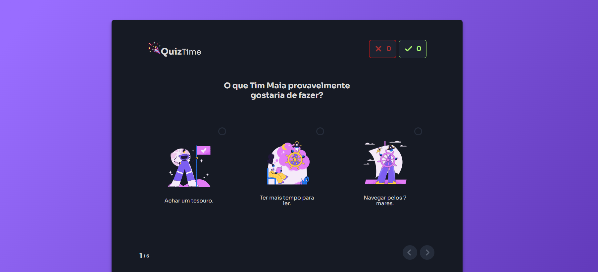

<h1 align="center"> Mini Quiz de Cards </h1>

Projeto teste de aprendizado

  <a href="#-tecnologias">Tecnologias</a>&nbsp;&nbsp;&nbsp;|&nbsp;&nbsp;&nbsp;
  <a href="#-projeto">Projeto</a>&nbsp;&nbsp;&nbsp;|&nbsp;&nbsp;&nbsp;
  <a href="#-licença">Licença</a>&nbsp;&nbsp;&nbsp;|&nbsp;&nbsp;&nbsp;

  

 

  

## 🚀 Tecnologias

Esse projeto foi desenvolvido com:

- HTML e CSS
- JavaScript
- Figma

## 💻 Projeto

Este projeto é um Mini Quiz feito para aprender e aprimorar meus conhecimento em HTML, CSS e JAVASCRIPT.

---

Feito por Guillermo Amadio
